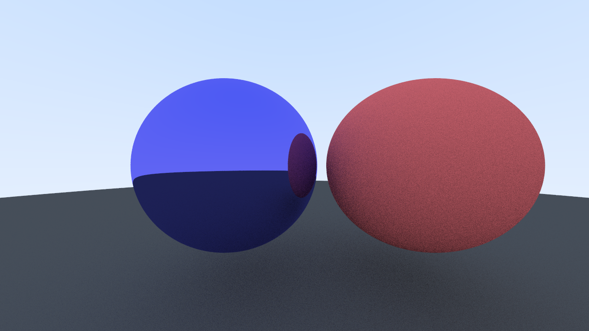

# Ray-Tracer

A ray-tracer I'm bulding as a learning project following the "Ray Tracing in One Weekend" and [pbrt.org](pbrt.org) books.

*"The line extends endlessly and is unending in both directions. The length of a line cannot be measured."*

### Day 1/2 - Balls

